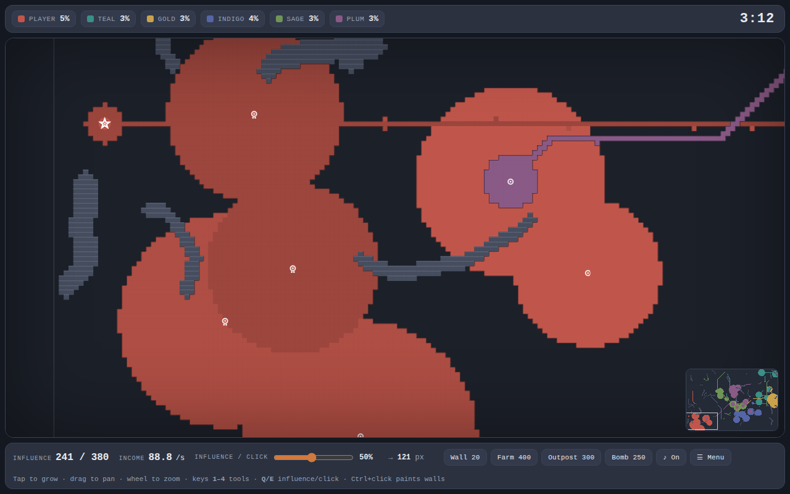
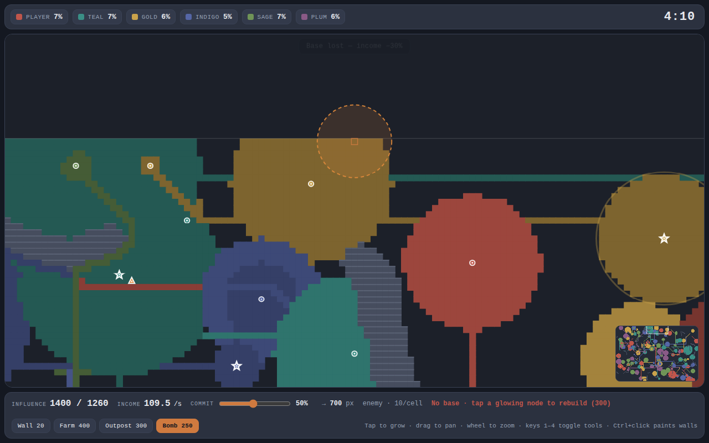
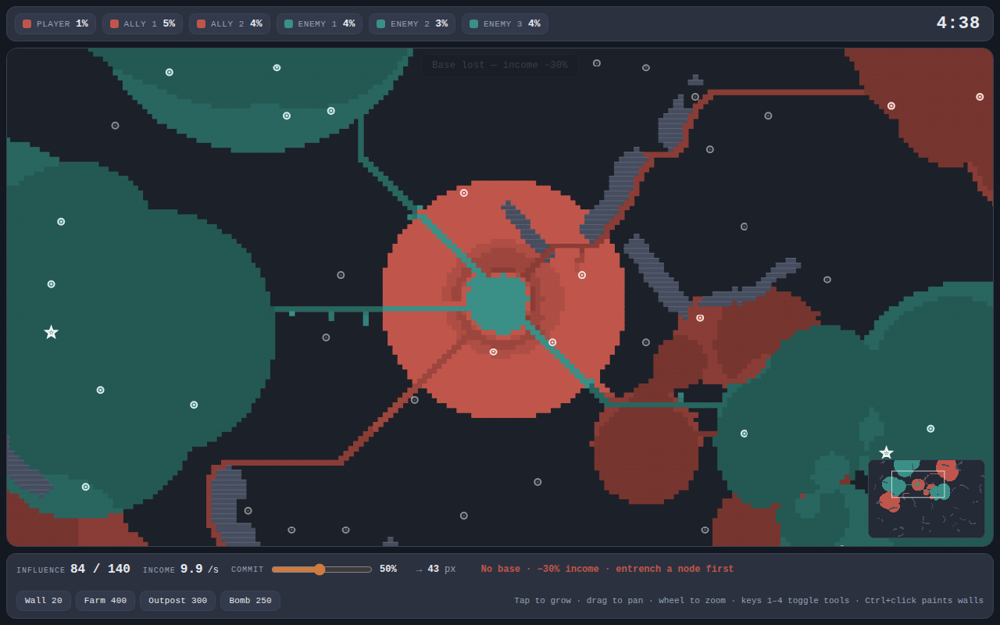
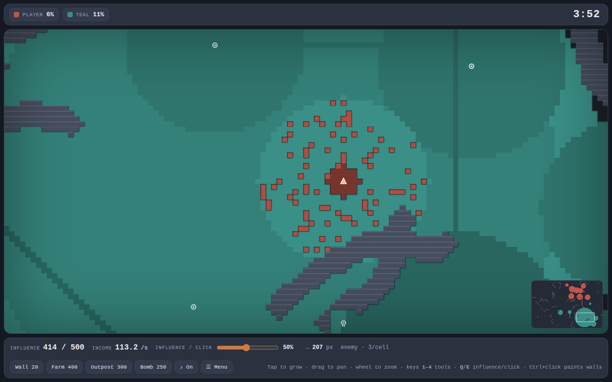
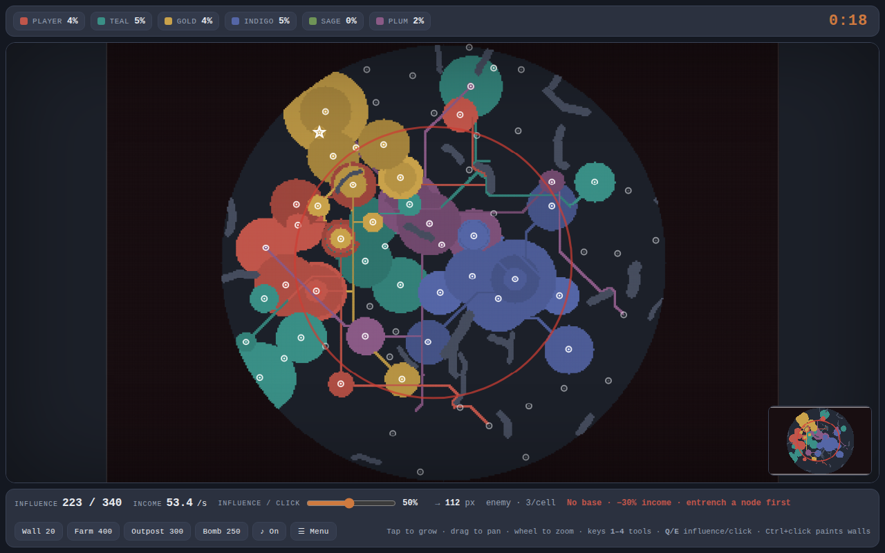
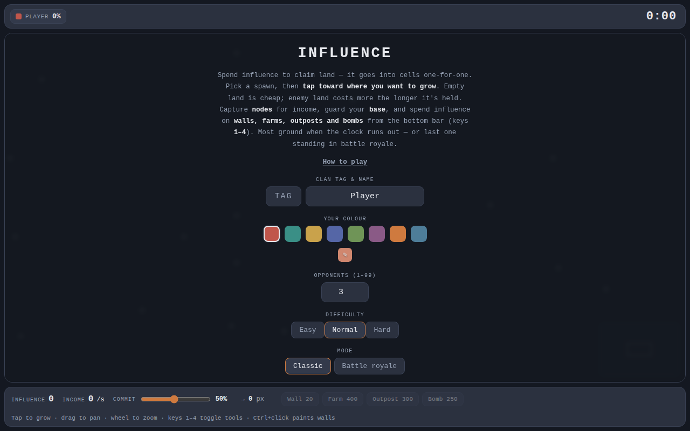

<div align="center">

# I N F L U E N C E

🟥🟥🟥⬛🟧⬛⬛🟧⬛🟨🟨🟨⬛🟩⬛⬛⬛🟦⬛⬛🟦⬛🟪🟪🟪⬛🟥⬛⬛🟥⬛⬛🟧🟧⬛🟨🟨🟨<br>
⬛🟥⬛⬛🟧🟧⬛🟧⬛🟨⬛⬛⬛🟩⬛⬛⬛🟦⬛⬛🟦⬛🟪⬛⬛⬛🟥🟥⬛🟥⬛🟧⬛⬛⬛🟨⬛⬛<br>
⬛🟥⬛⬛🟧⬛🟧🟧⬛🟨🟨⬛⬛🟩⬛⬛⬛🟦⬛⬛🟦⬛🟪🟪⬛⬛🟥⬛🟥🟥⬛🟧⬛⬛⬛🟨🟨⬛<br>
⬛🟥⬛⬛🟧⬛⬛🟧⬛🟨⬛⬛⬛🟩⬛⬛⬛🟦⬛⬛🟦⬛🟪⬛⬛⬛🟥⬛⬛🟥⬛🟧⬛⬛⬛🟨⬛⬛<br>
🟥🟥🟥⬛🟧⬛⬛🟧⬛🟨⬛⬛⬛🟩🟩🟩⬛🟦🟦🟦🟦⬛🟪🟪🟪⬛🟥⬛⬛🟥⬛⬛🟧🟧⬛🟨🟨🟨

**A fast browser land-grab.** Paint the map your colour, feed your economy, ruin somebody's afternoon.

[](https://evropiani.github.io/influence/influence.html)
[](https://evropiani.github.io/influence/)

  

</div>

---

## 📸 Screenshots

| The battlefield (Classic) | Bomb incoming |
|---|---|
|  |  |

| Teams (3v3) — one colour per side | Outpost chewing into enemy land |
|---|---|
|  |  |

**The Zone** — the red ring shows where the map collapses next:



> 📚 **Every mode and every tool has a step-by-step illustrated tutorial on the [How to Play page](https://evropiani.github.io/influence/).**

<details>
<summary>Start screen (colours, opponents, difficulty, mode)</summary>



</details>

## 🎯 The whole game in 10 seconds

You have **influence**. It buys land — one point per cell. Land and captured **nodes** make more influence. Hold the most ground when the clock stops (**Classic**) or be the last one standing (**Battle royale**). Everything else is spice.

- **Bright** enemy land is fresh, soft, and cheap to take. **Dark** land is dug in and expensive.
- Nodes 🎯 pay income, raise your influence cap, and extend your reach. Steal an enemy's for a fat bonus.
- Grey **rock barriers** ⬜ carve up the map — impassable, and new ones form *mid-round*. No sniping across open ground.
- Lose your **base** ⭐ and your income drops 30% until you rebuild.

## 🧰 Your toolbar

| Key | Tool | Cost | What it does |
|:---:|------|-----:|--------------|
| `1` | **Wall** | 20 | 25 durability. Attacks chip it down and leave visible **cracks**. (`Ctrl`+click also paints) |
| `2` | **Farm** | 400 | +120 influence every 15s, raises your cap. Economy engine. |
| `3` | **Outpost** | 300 | Chews up to 40 cells every 12s, prefers enemy land, acts as a **forward supply point**. Spearhead. |
| `4` | **Bomb** | 250 | Blast a crater out of enemy territory anywhere in supply range. The crater burns for 10s — the victim can't reclaim it, you can. On a cooldown. Outposts extend its reach. |

## 🕹️ Controls

| | PC | Mobile |
|---|---|---|
| Grow | Click toward target | Tap toward target |
| Pan / Zoom | Drag / wheel (WASD too) | Drag / pinch |
| Tools | Keys `1`–`4` or bottom bar | Bottom bar |
| Sound | `M` or the ♪ button | ♪ button |
| Jump | Click minimap | Tap minimap |

## 🤖 Modes & bots

- **Classic** — most territory when the clock runs out wins.
- **Battle royale** — no timer, last one standing wins.
- **The Zone** 🔴 — a circular map that collapses in **5 phases** (2 min each) toward a **random** spot — a red ring warns you 20 seconds ahead. Whatever falls outside is crushed, *including nodes* — and their cap and income die with them.
- **2v2 / 3v3** ⚔️ — bot allies in **your colour**. No friendly fire, shared supply range, most combined ground wins.
- **Difficulty** — Easy / Normal / Hard. Harder bots think faster, commit harder, and build farms and outposts of their own. Up to **99** opponents, if you're feeling brave.

## 🗂️ Project structure

```
.
├── index.html      # landing page / how-to-play
├── influence.html  # game markup
├── influence.css   # game styles
├── influence.js    # game logic
├── sound.js        # procedural music & sound effects (Web Audio)
├── changelog.html  # the changelog as a page on the site
├── screenshots/    # README & tutorial images
├── CHANGELOG.md    # what changed, newest first
└── favicon.svg
```

Self-contained vanilla HTML/CSS/JS — no build step, no dependencies, no framework.

## 🚀 Running locally

Open `influence.html` in a browser, or serve the folder:

```
npx serve .
```

## 🔧 Tuning

All game balance lives in the `CONFIG` object at the top of `influence.js` — map size, node count, incomes, costs, wall durability, barrier density, bot difficulty profiles (`DIFFS`). Tweak and reload.

## 📦 Deployment

Hosted on GitHub Pages straight from this repo — push to `main` and the live site updates.

## 💬 Feedback

It's a beta — expect things to change, break, and get better. Ideas, bugs, balance gripes: [@evropiani on Discord](https://discord.com/users/319246364246540288/).
